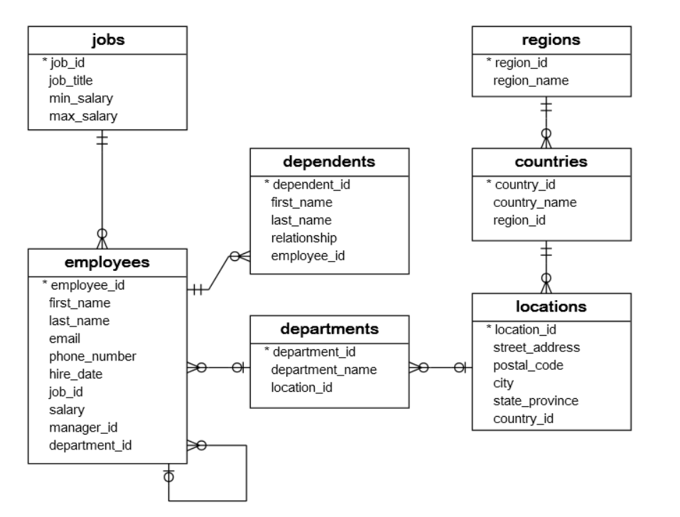

# 🗄️ HR Database – SQL Project

## 📖 Project Overview

This project demonstrates SQL concepts using the Oracle HR Sample Schema. It contains multiple related tables representing employees, departments, jobs, locations, countries, regions, and dependents.

The project includes **25 interview-oriented SQL queries** ranging from basic to advanced level, helping learners understand how to retrieve, analyze, and manipulate relational data.

---

## 🎯 Objectives

- Practice SQL using a real-world relational database.
- Learn how multiple tables are connected using primary and foreign keys.
- Solve interview-oriented SQL questions.
- Improve query writing and data analysis skills.

---

## 🛠️ Technologies Used

- Oracle Database


---

## 🗂️ Database Schema

This project uses the Oracle HR relational database schema.

### Tables Included

| Table | Description |
|--------|-------------|
| Employees | Stores employee information such as salary, department, manager, and job role. |
| Departments | Contains department details and their locations. |
| Jobs | Stores job titles and salary ranges. |
| Locations | Stores office addresses, cities, states, and countries. |
| Countries | Stores country names and their regions. |
| Regions | Stores geographical regions. |
| Dependents | Stores employee dependent information. |

---

## 🔗 Database Relationships

The tables are connected using **Primary Keys** and **Foreign Keys**.

Example relationships:

- One Region → Many Countries
- One Country → Many Locations
- One Location → Many Departments
- One Department → Many Employees
- One Job → Many Employees
- One Employee → Many Dependents
- One Employee → Can Manage Multiple Employees

---

## 🖼️ Entity Relationship Diagram (ERD)

The following ER diagram represents the database structure.



---

## 📂 Repository Structure

```
Employee-Management-SQL/
│
├── README.md
├── schema.sql
├── sample_data.sql
├── queries.sql
├── ER_Diagram.png

---

## 📚 SQL Concepts Covered

This project demonstrates:

- SELECT
- WHERE
- ORDER BY
- GROUP BY
- HAVING
- Aggregate Functions
- INNER JOIN
- LEFT JOIN
- SELF JOIN
- Subqueries
- Correlated Subqueries
- Window Functions
- Ranking Functions
- Date Functions

---

## 🚀 How to Run the Project

### Step 1: Clone the Repository

```bash
git clone https://github.com/your-username/Employee-Management-SQL.git
```

Or download the project as a ZIP file.

### Step 2: Open Oracle SQL Developer

Connect to your Oracle Database.

### Step 3: Create the Tables

Execute:

```
schema.sql
```

### Step 4: Insert Sample Data

Execute:

```
sample_data.sql
```

### Step 5: Run the SQL Queries

Open:

```
queries.sql
```

Run each query individually or execute the entire script to view the results.

---


## 👩‍💻 Author

**Shruti Hule**

Computer Engineering Student

### Skills

- SQL
- Oracle Database
- Power BI
- Python
- Excel
- Data Analytics

